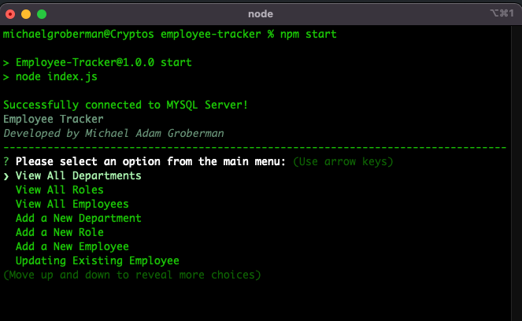

# Employee-Tracker

This application utilizes the CLI and is built using NodeJS, mysql, inquirer, chalk, and console.table.
It allows for a user to view and manage a Company's departments, roles, and employees.

The application gives yout the following options:

- View all Departments
- View all Roles, including the roles's ID, title, salary, and department that the role belongs to.
- View all Employees, including the employee's ID, title, salary, their reporting manager,and the department they belong to.
- Add a new Department (prompts for the Department Name)
- Add a new Role (prompts for Title, Salary, and Department ID)
- Add new Employee (prompts for first name, last name, role id, and thier manager's employee ID)
- Quit

## Installation

---

1. Run `npm install` to install all dependencies
2. Intall and run MySQL, then Source the `db/schema.sql` file to mysql. To do this, run mysql in your terminal. Then run 'source db/schema'. This creates the database and tables required in mysql.
   - (Optional) open mysql and run `source db/seeds.sql seeds` in your terminal to populate the database with test data.
3. Edit MySQL connection properties in the `connection` object on line-13 of `index.js`.

## Usage

---

1. Run `npm start` to start the application
2. Select from the menu and save typed user input with the 'enter/return' button.
   im
   

## Walkthrough Video
   
